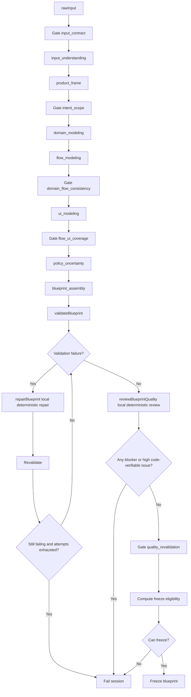
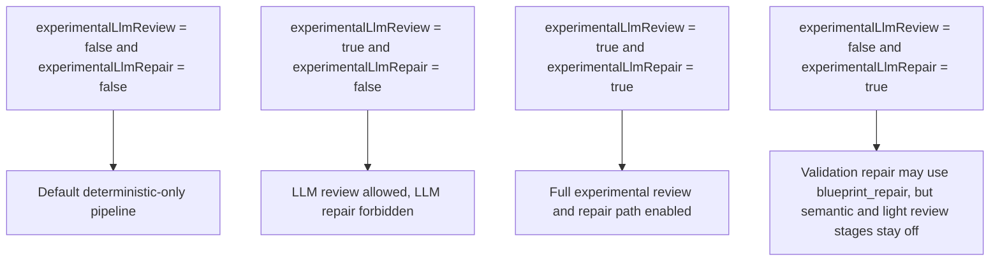

# Current Pipeline Mermaid

This document describes the **current implemented pipeline behavior** in code.

It covers:

- the default deterministic path
- the optional experimental LLM review and repair path
- validation, repair, and freeze decision points

## Full Pipeline

```mermaid
flowchart TD
  A["Start generateBlueprintFromInput(rawInput)"] --> B["Create session"]
  B --> C["Persist raw_input artifact"]
  C --> D["Persist global_policy_seed artifact"]
  D --> E{"Gate input_contract passed?"}
  E -->|No| Z1["Fail session"]
  E -->|Yes| F["input_understanding"]
  F --> G["product_frame"]
  G --> H["Persist input, product, users artifacts"]
  H --> I{"Gate intent_scope passed?"}
  I -->|No| Z1
  I -->|Yes| J["domain_modeling"]
  J --> K["flow_modeling"]

  K --> L{"experimentalLlmReview?"}
  L -->|Yes| M["flow_quality_review"]
  M --> N["Persist flow quality review"]
  N --> O{"Flow light review gate passed?"}
  O -->|Yes| P["Check structural domain_flow_consistency gate"]
  O -->|No and experimentalLlmRepair| Q["resolveLayerQualityBlockers for flow layer"]
  O -->|No and no experimentalLlmRepair| Z1
  Q --> R["Persist repaired flow artifact"]
  R --> S["Rerun flow_quality_review"]
  S --> T["Persist resolved flow quality review"]
  T --> U{"Flow resolved light review gate passed?"}
  U -->|No| Z1
  U -->|Yes| P
  L -->|No| P

  P --> V{"Gate domain_flow_consistency passed?"}
  V -->|No| Z1
  V -->|Yes| W["ui_modeling"]

  W --> X{"experimentalLlmReview?"}
  X -->|Yes| Y["ui_contract_review"]
  Y --> AA["Persist UI contract review"]
  AA --> AB{"UI light review gate passed?"}
  AB -->|Yes| AC["Check structural flow_ui_coverage gate"]
  AB -->|No and experimentalLlmRepair| AD["resolveLayerQualityBlockers for UI layer"]
  AB -->|No and no experimentalLlmRepair| Z1
  AD --> AE["Persist repaired UI artifact"]
  AE --> AF["Rerun ui_contract_review"]
  AF --> AG["Persist resolved UI contract review"]
  AG --> AH{"UI resolved light review gate passed?"}
  AH -->|No| Z1
  AH -->|Yes| AC
  X -->|No| AC

  AC --> AI{"Gate flow_ui_coverage passed?"}
  AI -->|No| Z1
  AI -->|Yes| AJ["policy_uncertainty"]
  AJ --> AK["Persist visual, generation, uncertainty artifacts"]
  AK --> AL["Assemble blueprint payload in code"]
  AL --> AM["blueprint_assembly"]
  AM --> AN["Persist blueprint artifact"]
  AN --> AO["Create blueprint version draft"]
  AO --> AP["validateBlueprint"]
  AP --> AQ["Persist validation report"]
  AQ --> AR{"Gate full_deterministic_validation passed?"}
  AR -->|No| AS["Enter validation repair loop"]
  AR -->|Yes| AT["Mark blueprint version validated"]

  AS --> AU["Create repair plan from validation issues"]
  AU --> AV["repairBlueprint deterministic local repair"]
  AV --> AW{"experimentalLlmRepair?"}
  AW -->|Yes| AX["blueprint_repair LLM stage"]
  AW -->|No| AY["Persist locally repaired blueprint"]
  AX --> AZ["Persist LLM repaired blueprint"]
  AY --> BA["Create blueprint version repaired"]
  AZ --> BA
  BA --> BB["Re-run validateBlueprint"]
  BB --> BC["Persist validation report"]
  BC --> BD{"Still failing and attempts left?"}
  BD -->|Yes| AU
  BD -->|No and failed| Z1
  BD -->|No and passed| AT

  AT --> BE{"experimentalLlmReview?"}
  BE -->|No| BF["reviewBlueprintQuality local deterministic review"]
  BF --> BG["Persist quality review report"]
  BG --> BH{"Any blocker or high issue?"}
  BH -->|Yes| Z1
  BH -->|No| BI["Gate quality_revalidation"]

  BE -->|Yes| BJ["semantic_quality_review"]
  BJ --> BK["Merge semantic report with local quality report"]
  BK --> BL["Persist quality review report"]
  BL --> BM{"routeQualityIssues result"}
  BM -->|no_repair_needed| BI
  BM -->|manual_blocking_issue| Z1
  BM -->|repair needed and no experimentalLlmRepair| Z1
  BM -->|repair needed and experimentalLlmRepair| BN["Create quality repair plan"]
  BN --> BO["repairBlueprintQuality deterministic local quality repair"]
  BO --> BP["quality_repair LLM stage"]
  BP --> BQ["Persist quality repair candidate"]
  BQ --> BR["post-repair guard enforces invariants"]
  BR --> BS["Persist guarded blueprint"]
  BS --> BT["Create blueprint version quality_repaired"]
  BT --> BU["Re-run validateBlueprint"]
  BU --> BV["Persist validation report"]
  BV --> BW{"Quality attempts left?"}
  BW -->|Yes continue| BJ
  BW -->|No failed| Z1
  BW -->|No passed| BI

  BI --> BX["Compute freeze eligibility"]
  BX --> BY{"Can freeze?"}
  BY -->|No| Z1
  BY -->|Yes| BZ["Supersede prior non-frozen blueprint versions"]
  BZ --> CA["Mark blueprint version frozen"]
  CA --> CB["Set session.activeBlueprintId"]
  CB --> CC["Return frozen blueprint"]
```

## Default Deterministic Path

## Experimental Flag Combinations

## Current Behavioral Summary

- Default pipeline does not run:
  - `flow_quality_review`
  - `ui_contract_review`
  - `semantic_quality_review`
  - `quality_repair`
  - `blueprint_repair`

- Default pipeline does run:
  - first-pass LLM generation stages
  - deterministic gates
  - deterministic validation
  - deterministic local `repairBlueprint(...)`
  - deterministic local `reviewBlueprintQuality(...)`
  - freeze eligibility check

- Experimental pipeline may additionally run:
  - layer-level LLM review
  - layer-level LLM-assisted quality repair
  - final semantic LLM review
  - final `quality_repair`
  - `blueprint_repair`

