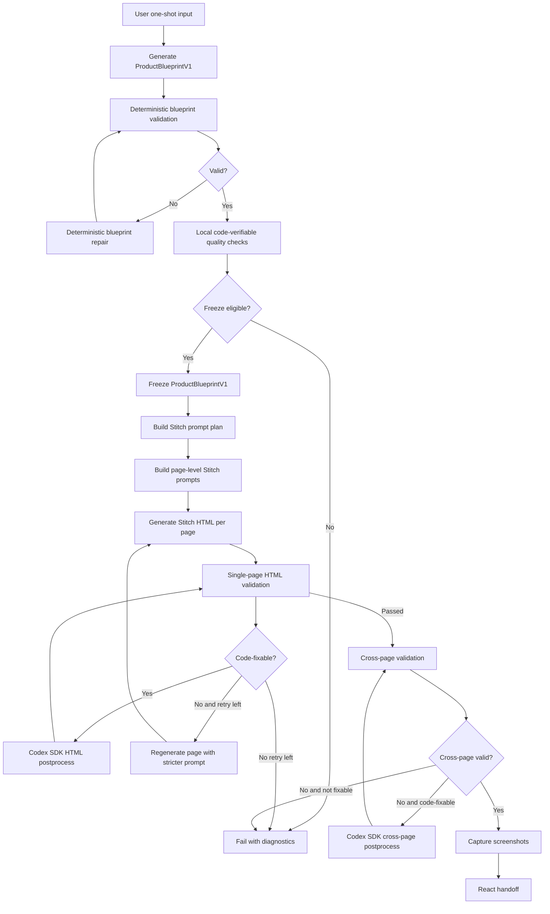
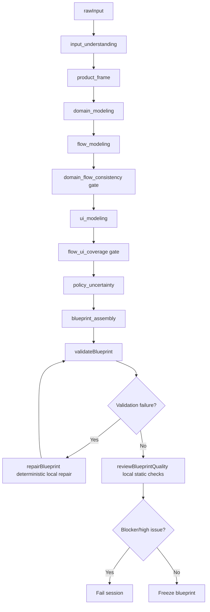
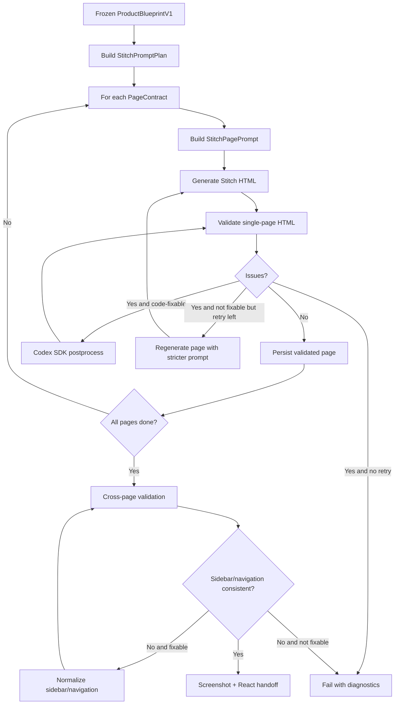

# Current Pipeline Mermaid

This document shows the current intended pipeline at a high level.

For detailed stage rules, read:

```text
docs/productblueprintv1-generation-pipeline-design.md
docs/stitch-html-generation-pipeline-design.md
docs/stitch-ui-constraints-yaml-design.md
docs/stitch-html-validation-design.md
docs/stitch-html-postprocess-design.md
```

## End-to-end pipeline



## Default blueprint pipeline



## Default Stitch HTML pipeline



## Default disabled paths

By default, the pipeline does not run LLM repair.

Disabled unless explicitly experimental:

```text
flow_quality_review
ui_contract_review
semantic_quality_review
blueprint_repair LLM stage
quality_repair LLM stage
LLM HTML patch repair
```

Default repair is deterministic and code-verifiable.
