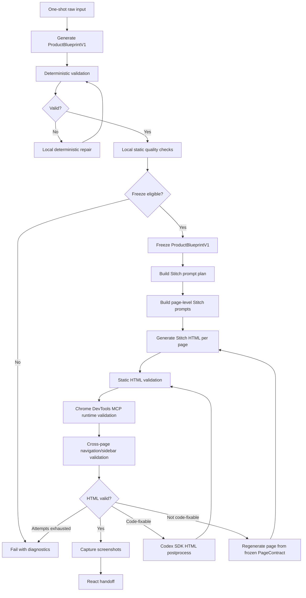
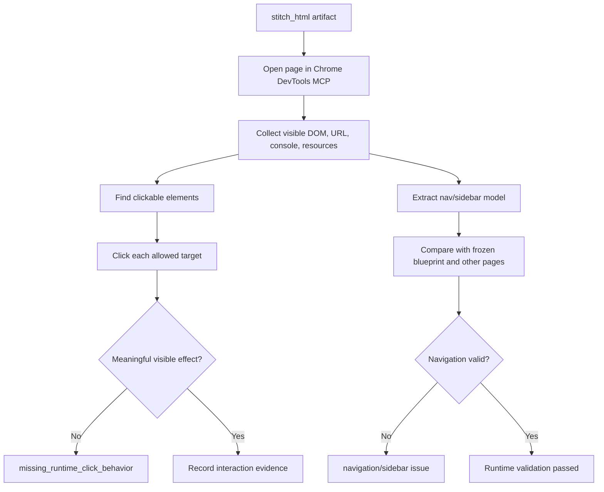
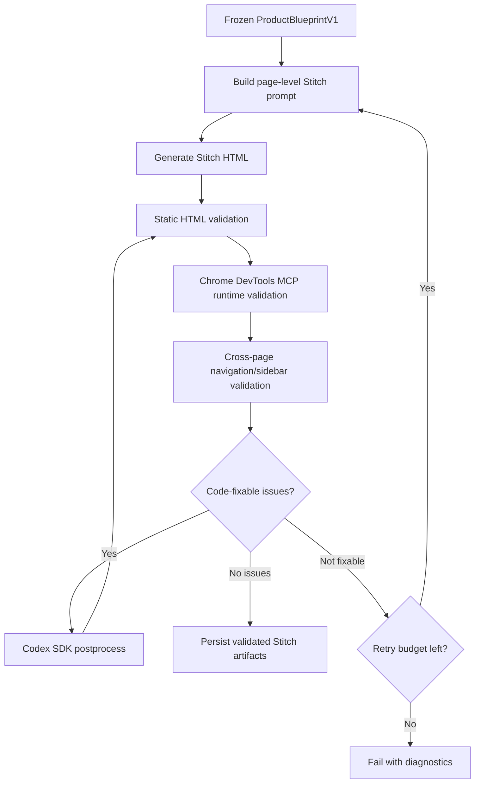

# Current Pipeline Mermaid

This document shows the current default pipeline at a high level.

The default blueprint path remains deterministic after first-pass generation. Stitch HTML generation now adds Chrome DevTools MCP runtime validation before React handoff.

## Full Default Pipeline

## Stitch HTML Runtime Validation Detail

## Default Behavior

- Default blueprint generation does not use LLM repair.
- Stitch generation is page-by-page from the frozen blueprint.
- Static HTML validation catches obvious structure issues.
- Chrome DevTools MCP validates real click behavior, rendered page health, console/runtime errors, and navigation behavior.
- Codex SDK postprocess may fix code-verifiable HTML issues, then validation must run again.

## Stitch HTML Runtime Validation Path

